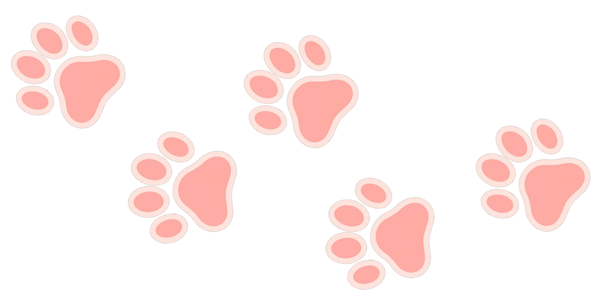

<p align="center">
 <br>
</p>

<div align="center">
<h1>COALA: Numerically Stable and Efficient Framework for Context-Aware Low-Rank Approximation</h1>
  <div align="center">
  <a href="https://opensource.org/licenses/Apache-2.0">
    
  </a>
  <a href="https://pytorch.org/">
    
  </a>
  <a href="https://huggingface.co/docs/transformers">
    
  </a>
  <a href="https://huggingface.co/meta-llama/Meta-Llama-3-8B">
    
  </a>
  <a href="https://huggingface.co/mistralai/Mistral-7B-v0.1">
    
  </a>
</div>
</div>

## Introduction
  
> **[SVD-LLM: Truncation-aware Singular Value Decomposition for Large Language Model Compression](https://arxiv.org/abs/2507.07580)**
> 
> *Uliana Parkina<sup>1</sup>, Maxim Rakhuba<sup>1</sup>*   
> *<sup>1</sup>HSE University*
> 
> 39th Conference on Neural Information Processing Systems (NeurIPS 2025)

**Note:** Low-rank approximation solvers are implemented in `lib.Solvers` as standalone components, so you can easily reuse them in your own project.

## Quick Start

```
conda create -n coala_env python=3.10.12
conda activate coala_env
pip install -r requirements.txt
```

First, select the model you want to run (`llama3_1b`, `llama3_8b`, or `mistral_7b`) and initialize the corresponding datasets. Then generate a small set of initialization samples. 
```
# 1) Choose a model: llama3_1b | llama3_8b | mistral_7b
#    Initialize datasets for the selected model
./scripts/dataset.sh llama3_1b

# 2) Generate initialization samples
./generators/samples.sh 8 common-reasoning
# ./generators/samples.sh 256 wiki2
```
After that, you can run the compression pipeline and validate the results:
```
./examples/llama3_1b/run.sh
```

## Citation
If you find this work useful or relevant to your project and research, please kindly cite our paper:
```
@inproceedings{
    parkina2025coala,
    title={{COALA}: Numerically Stable and Efficient Framework for Context-Aware Low-Rank Approximation},
    author={Uliana Parkina and Maxim Rakhuba},
    booktitle={The Thirty-ninth Annual Conference on Neural Information Processing Systems},
    year={2025},
}
```